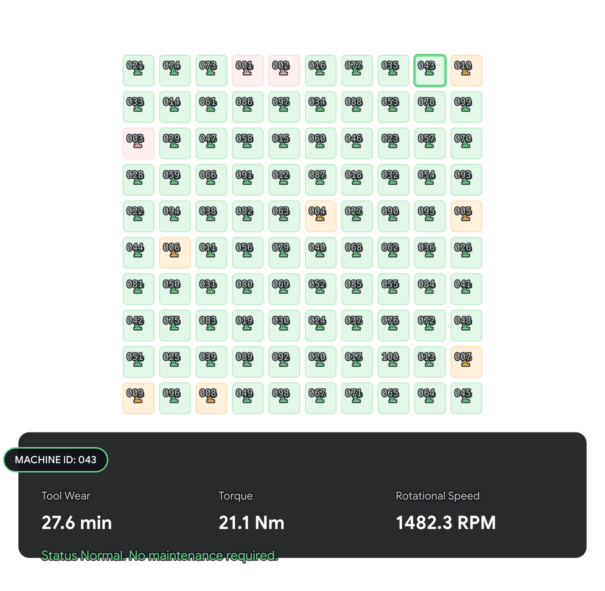

# Predictive Maintenance — Machine Failure Prediction


 
Built on the AI4I 2020 synthetic industrial dataset. The goal was to predict machine failures from sensor readings and deploy it as a usable API — not just a notebook.
 
---
 
## What's in here
 
**`notebook/`** — EDA, feature analysis, model training and evaluation.
 
**`machine-failure-api/`** — FastAPI service that takes sensor readings and returns a risk alert. Two models run in parallel — one tuned for recall, one for balance — giving a 3-level output: RED, ORANGE, or GREEN.
 
---
 
## Key findings
 
- Dataset is synthetic and heavily imbalanced (~3% failures). Normal accuracy is a useless metric here.
- Features like torque and tool wear show signal but with heavy class overlap — clean separation isn't possible.
- Logistic Regression failed. Random Forest handled the non-linearity better.
- SMOTE didn't help much — introduced noise without meaningful recall gain.
- Threshold tuning mattered more than model choice. RF at 0.3 threshold gave the best practical trade-off (~0.74 recall).
- Final design: two models with different risk tolerances used as a layered alert system.
 
---
 
## Running the API
 
```bash
cd machine-failure-api
uv sync
uv run uvicorn main:app --reload
```
 
Models are not included in this repo. Train them from the notebook and place the `.pkl` files in `machine-failure-api/models/`.
 
---
 
*Full documentation, architecture breakdown and deployment guide coming after exams.*
 
